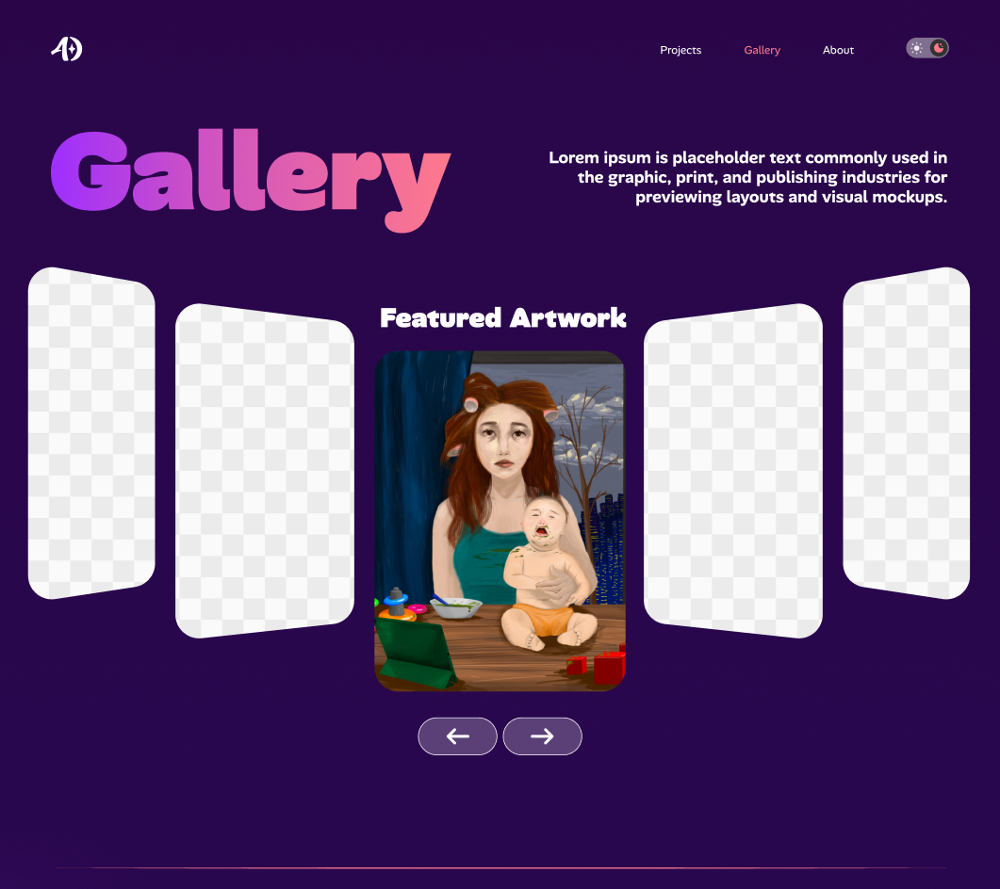
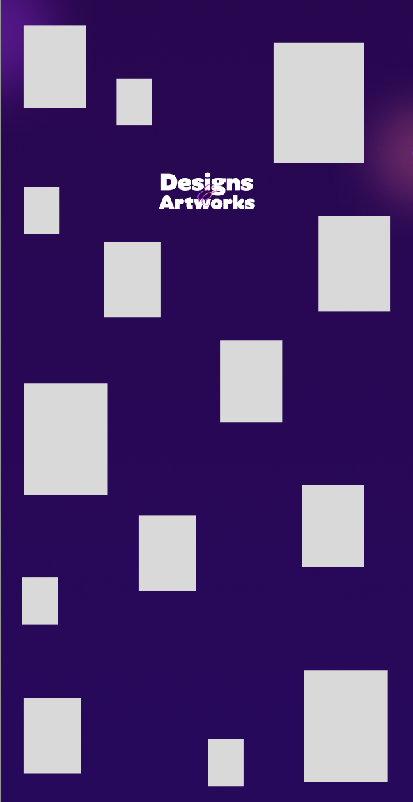

**What is the work you’re taking on?
I will redesign and enhance my Gallery page by transforming it from a static grid into an interactive, motion-based experience.

Here is what I'm going to do:
_Favorite artwork carousel (top of page):
A horizontal carousel will highlight my favorite projects. The users can navigate using arrows or swipe/drag. This would allow me to direct attention to my strongest work first.
_Scroll moving gallery:
When the user scrolls, the title “Design & Artworks” stays pinned in place while the random size artwork thumbnails move vertically from bottom to top around it.
The more the user scrolls, the more pieces enter the screen.

**How do you think this is going to enhance your body of work? Will it be a new entry, or an interesting interaction?

This would help improve my portfolio in many ways:
_Shows my abilities in UX/UI and interaction design, not only visual design.
_Demonstrates my skills in developing frontend website
_Makes my site more interesting and enjoyable to explore. This would help encourage users such as recruiters and employers to stay longer and scroll more.
_Instead of just displaying images, I am designing an experience.

Include:
Lo-fi mock-ups of the concept.
Examples to help explain your concept.

here is my figma link https://www.figma.com/design/jKbhRebHB3G6UyKYQV78Jt/Portfolio-Website?node-id=1-3&t=cbQuVlGcPNJ7IdE1-1

Any resources you plan on using.
https://www.ryucreative.com/portfolio-3-1/graphic-design
http://dribbble.com/shots/25889089-Ethereal-UI-Theme-Carousel

Any resources you plan on using.
My plan for this is using JavaScript scroll events and Gsap for the better smooth scrolling motion.

Any fears, uncertainties, doubts about the implementation.
I afraid the interaction may take longer or harder to build than I expected, and I need to ensure the layout and animations work well for different screen sizes, and bugs on certain devices/browsers.
